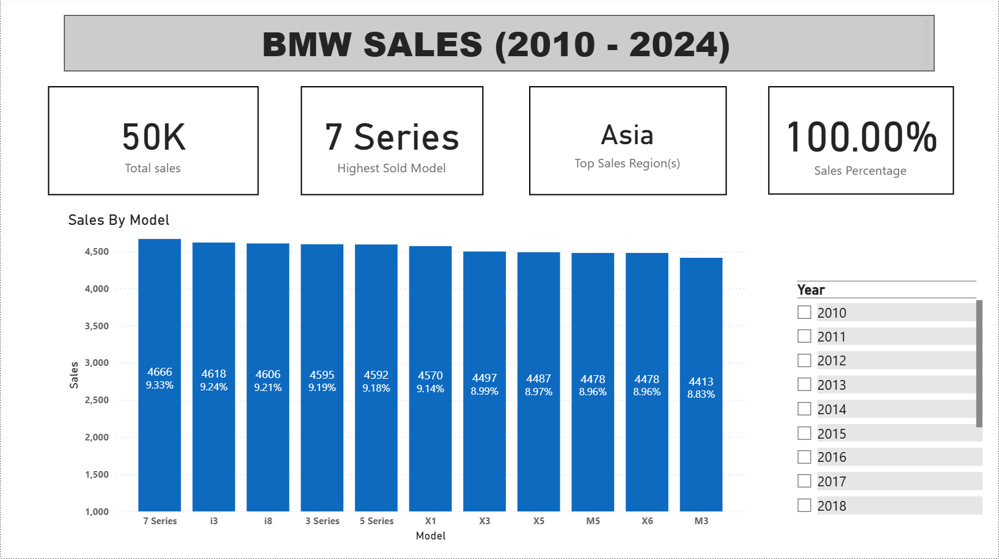
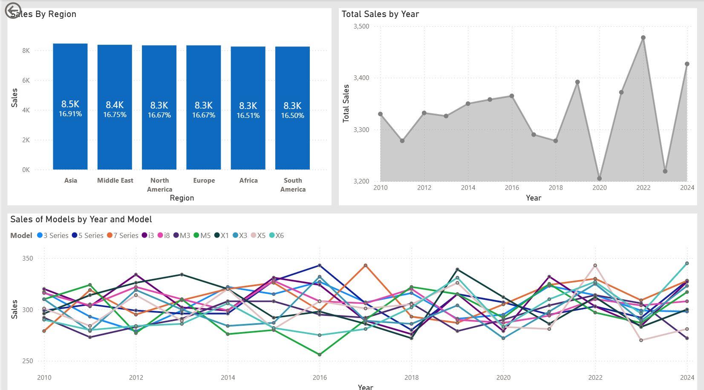
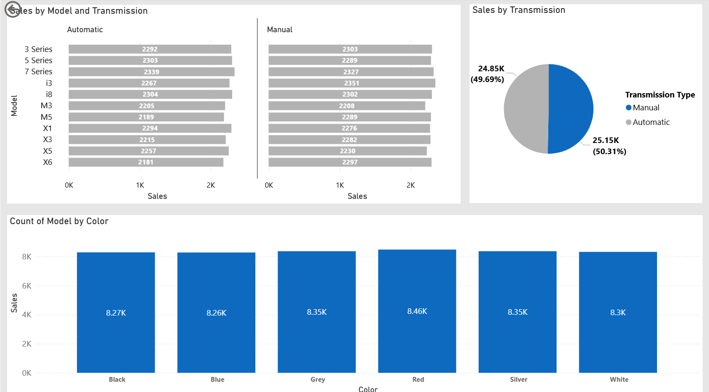
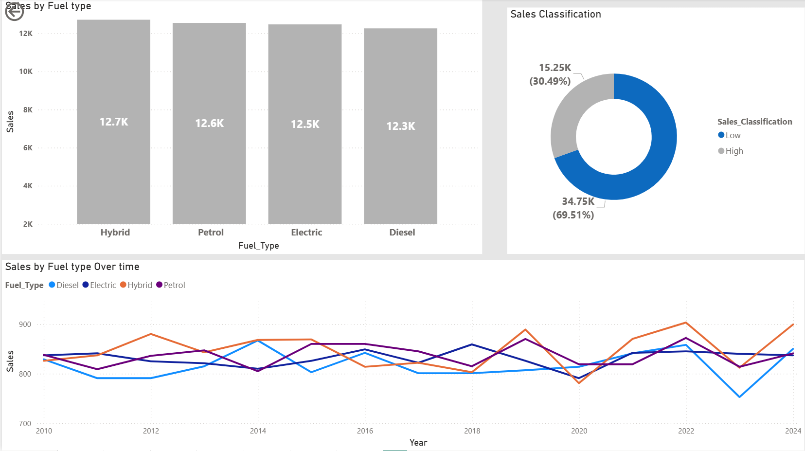

# BMW Sales Dashboard (2010 – 2024)
### Built with Power BI | Data Source: Kaggle

---

## About the Project

Built entirely in Power BI, this dashboard dissects BMW's global sales performance across 2010 to 2024. Leveraging a Kaggle dataset, the full analytical pipeline was engineered from scratch — from data cleaning and transformation in Power Query to building dynamic DAX measures and KPIs that respond in real time to user-applied filters.

The result is an interactive, multi-page business intelligence layer that lets stakeholders slice through 50,000 sales records by model, region, fuel type, transmission, color, and year without ever touching a spreadsheet. Every visual was designed with a specific business question in mind, making the dashboard not just informative but immediately actionable.

**Tools and Technologies Used**

| Tool | Purpose |
|---|---|
| Power BI Desktop | Dashboard development and visualization |
| Power Query | Data cleaning and transformation |
| DAX | Dynamic measures, KPIs, and calculated columns |
| Kaggle | Data source |

---

## Problem Statement

BMW's sales data held answers that static reports could not surface. The business lacked a unified view to answer critical questions around model performance, regional contribution, buyer preferences, and year-over-year trends — leaving strategy, inventory, and marketing decisions without a reliable data foundation.

This project was built to answer the following core business questions:

- Which BMW models and regions contribute the most to overall sales performance?
- How do vehicle attributes such as fuel type, transmission, and color influence sales distribution?
- What patterns emerge in year-over-year sales trends, and how do individual models perform over time?
- Where do opportunities exist to sharpen product strategy, market focus, and inventory planning?

---

## Dashboard Snapshots

### Overview: Sales by Model

### Regional and Yearly Trends

### Transmission and Color Analysis

### Fuel Type and Sales Classification

---

## Output Interpretation

The dashboard delivers insight across four focused views, with key indicators including:

**Overall Performance**
- 50,000 total sales recorded across the full 14-year period
- 7 Series ranked as the highest sold model at 9.33% share, followed closely by i3 at 9.24% and i8 at 9.21%
- Sales distribution across models is relatively competitive, with all top 11 models holding between 8.83% and 9.33% share

**Regional Insights**
- Asia leads all regions at 16.91% of total sales (8.5K units), followed by Middle East at 16.75% and North America at 16.67%
- Sales distribution across all six regions is remarkably balanced, indicating a globally diversified market presence
- 2022 recorded as the peak sales year, followed by a partial correction in 2024

**Transmission and Color**
- Near equal transmission split with Automatic at 49.69% (24.85K) and Manual at 50.31% (25.15K), suggesting no strong buyer preference dominance
- Red emerged as the top performing color variant at 8.46K units, with Grey and Silver tied at 8.35K
- All color variants perform within a very close range, indicating broad and balanced demand across color preferences

**Fuel Type and Sales Classification**
- Hybrid leads fuel type sales at 12.7K, followed by Petrol at 12.6K, Electric at 12.5K, and Diesel at 12.3K
- Fuel type performance is closely distributed, reflecting BMW's diversified powertrain strategy
- 69.51% of all transactions are classified as low value sales, with the remaining 30.49% falling under high value, reflecting a broad and accessible market reach across BMW's portfolio.
---

## Results

The dashboard transformed a flat dataset into a fully navigable business intelligence tool. Decision makers can now isolate performance by any combination of year, model, region, or vehicle attribute in seconds, without relying on manual reporting or static summaries.

The project demonstrates a complete end-to-end analytical workflow — data wrangling, measure engineering, and visual storytelling — delivering a solution that is not just insightful but built to support informed, real-time decisions across marketing, operations, and product strategy teams.

**Key outcomes delivered:**
- Centralized 50K records into a single interactive dashboard with dynamic filtering
- Engineered reusable DAX measures for KPIs that auto-update with every filter selection
- Surfaced regional, model-level, and attribute-driven patterns that were previously invisible in raw data
- Designed a multi-page layout that guides stakeholders from high-level overview to granular insight

---

## Connect with Me

**Sai Deepak Poondla**
Data Analyst | Power BI | SQL | Python | Tableau

[LinkedIn](http://www.linkedin.com/in/sai-deepak-poondla-7143ba21a) | [Portfolio](https://saideepakp.github.io)
